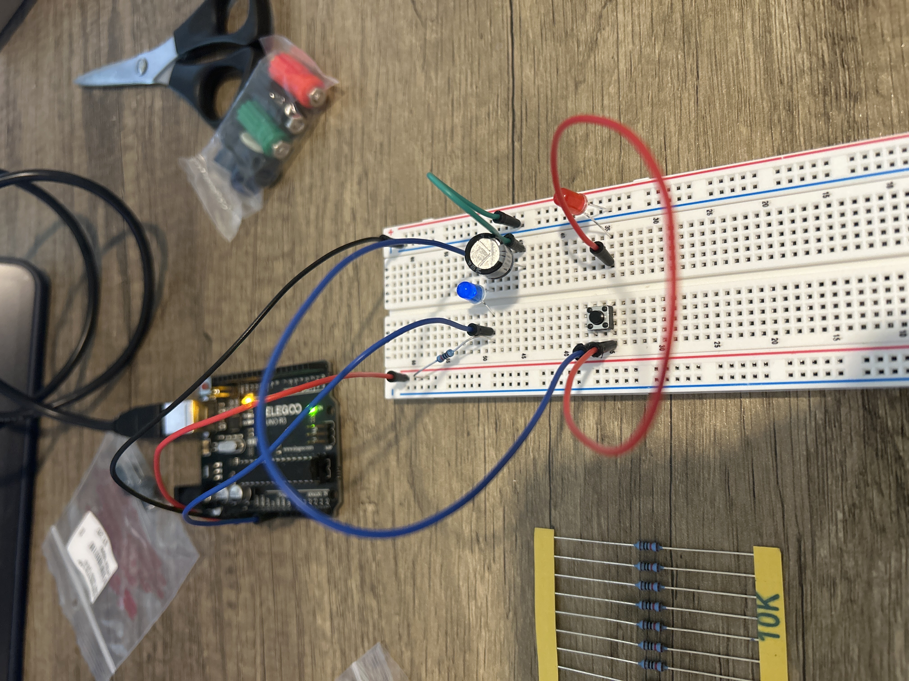

# Capacitor Charge/Discharge Visualizer

## Overview
This project demonstrates the charging and discharging behavior of a capacitor in a basic RC (resistor–capacitor) circuit, using an **Arduino Uno** for voltage measurement and visualization.  
The circuit is built on a breadboard and monitored via the Arduino Serial Plotter or a Python live-plotting script.

## Features
- Real-time measurement of capacitor voltage
- Visual display of charge/discharge curves
- Arduino Serial Plotter support
- Optional Python-based live plotting with **Matplotlib** and **PySerial**
- Easy-to-modify resistor/capacitor values to observe different time constants

## Hardware Requirements
- 1 × Arduino Uno (or compatible board)
- 1 × Breadboard
- 1 × Capacitor (tested with 100 µF electrolytic)
- 1 × Resistor (tested with 10 kΩ)
- Jumper wires
- USB cable for Arduino

*(Optional)*
- Push button for manual charge/discharge control
- LEDs (for testing only; direct series connection with the capacitor will distort results)

## Software Requirements
- Arduino IDE
- Python 3.x (optional for external visualization)
  - `pyserial`
  - `matplotlib`

## Circuit Diagram
  

### Basic Wiring
1. Connect one leg of the capacitor to GND, the other to a resistor leading to 5V.
2. Attach an analog input pin (e.g., A0) to the capacitor’s positive leg.
3. (Optional) Add a push button to control charging and discharging.

## How It Works
1. **Charging phase**: Applying 5V through the resistor charges the capacitor gradually.
2. **Discharging phase**: Disconnecting from 5V allows the capacitor to release its stored energy through the resistor.
3. The Arduino reads the capacitor voltage via an analog input and sends it to the Serial Monitor/Plotter.
4. The voltage-time graph follows the exponential charging/discharging pattern predicted by RC theory.

## Lessons Learned
- Placing an LED **in series** with the capacitor can block full charging/discharging due to voltage drop and altered current flow.
- Understanding the current path is critical in RC circuit design.
- Learned to troubleshoot both hardware wiring issues and serial data flow problems.
- Python visualization can enhance data analysis, but serial communication must be carefully managed to avoid port conflicts.

